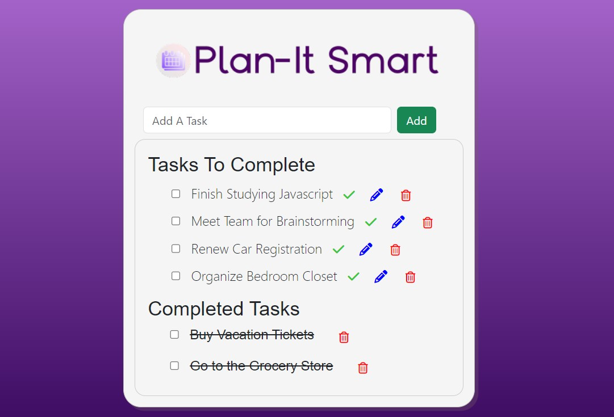

# Plan-It Smart
Plan-It Smart is a basic To-Do List app built with HTML, CSS, and JavaScript that allows users to manage tasks effectively. Users can perform the following actions within the app:

1. **Add a Task:** Users can input new tasks into the text field and add them to the list by clicking the "Add" button. The new task is then displayed in the Tasks To Complete list.

2. **Edit a Task:** Each task in the list can be edited. Users must click the check box for each task, and then the pencil icon to edit or change a task, making it easy to update task details.

3. **Delete a Task:** Tasks that are no longer needed can be removed from both the Tasks to Complete and Completed Tasks lists by clicking the check box, and then clicking on the trash icon. 

4. **Complete a Task:** When a user finishes a task, they can mark it as complete by clicking the check box, and then clicking on the check mark icon. The completed task will be moved to the Completed Tasks list. 

The user interface is designed with HTML and CSS to create an organized and user-friendly layout. JavaScript is used to handle the dynamic functionality of adding, editing, deleting, and completing tasks. To view a live demo, click https://vnpugh.github.io/JS-Plan-It-Smart/

  